This page outlines the software architecture, detailing how different user roles, frontend applications, and backend services interact within the POS platform, which serves as the core system enabling restaurant operations. The image diagram illustrates the key components and their interactions, providing a comprehensive overview.

### System Components

The system consists of multiple interconnected components:

### 1. Users & Roles

Users interact with the system through different applications, each tailored to their needs:

- **Patron (Customer)**: Browses the menu, places orders, and makes payments.
- **Admin (Manager)**: Oversees platform operations, manages menus, users, and business analytics.
- **Staff (Employees)**: Monitors and fulfills orders using a kitchen display system.

### 2. Frontend Applications

A dedicated frontend application supports each user role:

- **Food Ordering Application** (for Patrons): Provides a menu interface and checkout experience.
- **Kitchen Display System (KDS)** (for Staff): Displays real-time orders and preparation workflows.
- **Admin Application** (for Managers): Controls restaurant operations and settings.

### 3. POS platform (Backend Services)

The **POS Platform** serves as the central system that connects all frontend applications. It provides:

- **API gateway**: Handles authentication and request routing (`POST /auth/token`).
- **Order Management Service**: Manages orders (`POST /orders`, `PUT /orders/{id}`).
- **User Management Service**: Handles accounts and roles (`GET /users`, `POST /users`).
- **Menu service**: Manages dish availability and pricing (`GET /dishes`, `POST /dishes`).
- **Payment processing**: Integrates with external providers and records transactions (`POST /orders` with payment data).

### Data flow & synchronization

The system ensures real-time updates through API interactions:

1. **Customers** place orders via the Food Ordering App (`POST/orders`).
2. **Orders** are stored in the POS system and sent to the Kitchen Display System (`GET/orders?status=Received`).
3. **Staff** updates order status (`PUT /orders/{id}`), reflecting changes across applications.
4. **Admins** monitor operations and adjust settings (`PUT /dishes/{id}`, `DELETE /users/{id}`).
5. **All data** is synchronized using RESTful APIs and WebSockets (for real-time updates).

### Security and authentication

- **Role-based access control (RBAC)**: Ensures that only authorized users can access certain endpoints.
- **Token-based authentication**: Uses JWT (`POST /auth/token`) for secure access.
- **Data encryption**: Protects user and payment data at rest and in transit.

