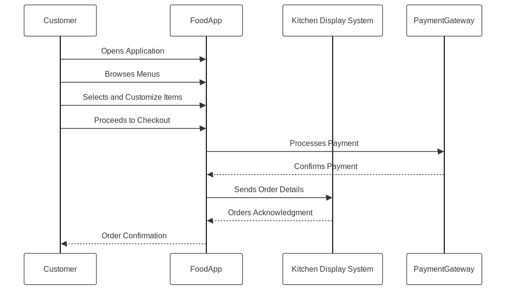
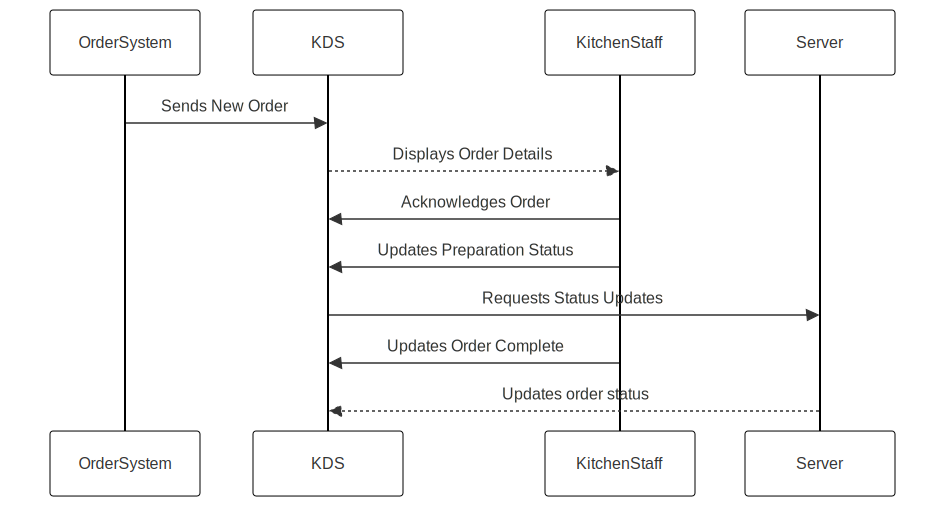
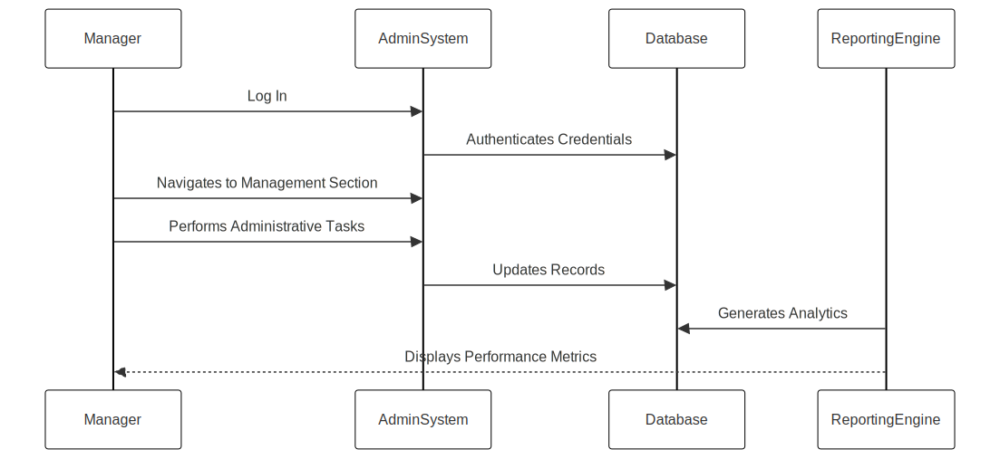

## Food ordering application

Enables customers to browse menus, place orders, and complete purchases through a digital platform.

### **How it works**

  ## Kitchen Display System (KDS)

Manages and tracks restaurant kitchen orders digitally to improve operational efficiency.

### How it works

## Admin panel application

Provides restaurant management tools for administrative tasks and business insights.

### How it works

