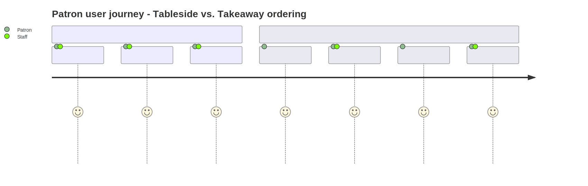

Our POS API supports food ordering experiences, catering to both tableside and takeaway services. You can effortlessly place orders through mobile apps, self-service kiosks, or restaurant-provided tablets.

The **Food ordering system** enhances the restaurant experience by providing a seamless digital platform for dine-in and takeaway orders. It streamlines the ordering process, reduces wait times, and improves customer satisfaction through self-service options.

### Key Features

- **Intuitive Dashboard** – Enables easy menu navigation for patrons.
- **Comprehensive Menu Browsing** – Displays detailed dish information and customization options.
- **Flexible Ordering System** – Supports both tableside and takeaway services.
- **Real-time Order Tracking** – Provides status updates and order confirmations.
- **Integrated Payment Processing** – Supports multiple payment methods.

The system ensures an efficient and user-friendly ordering experience by catering to casual diners and those seeking quick service. Its dual support for tableside and takeaway orders allows restaurants to maintain high service quality.

The diagram below outlines two parallel ordering workflows - tableside and takeaway - showing how patrons and staff interact throughout the ordering process.

Below are the API calls you will need to make to get your order.

| API | Description |
| --- | --- |
| `POST/orders` | Create an order |
| `GET/orders` | Retrieve a list of orders |
| `GET/orders/{id}` | Retrieve a specific order by ID |
| `GET/orders/{id}/dishes` | Retrieve dishes for a specific order |